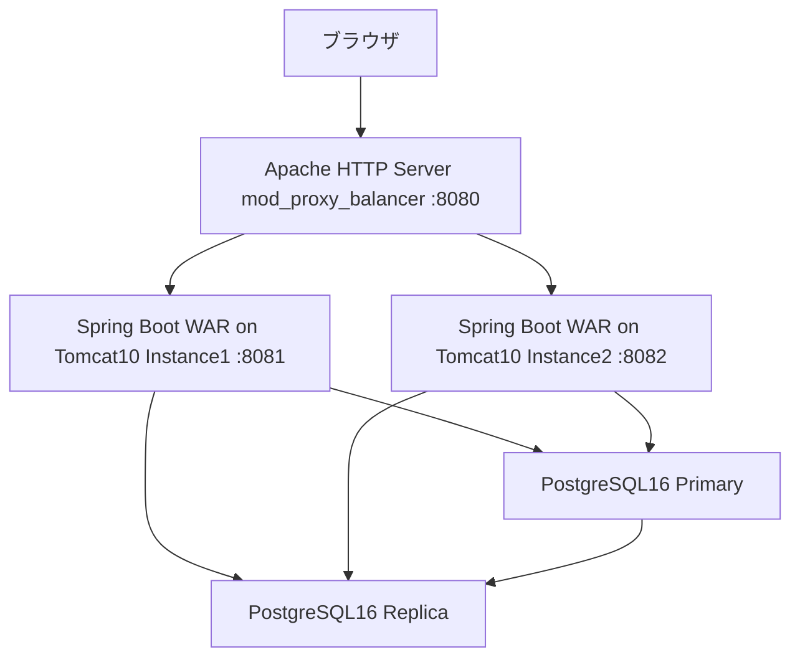
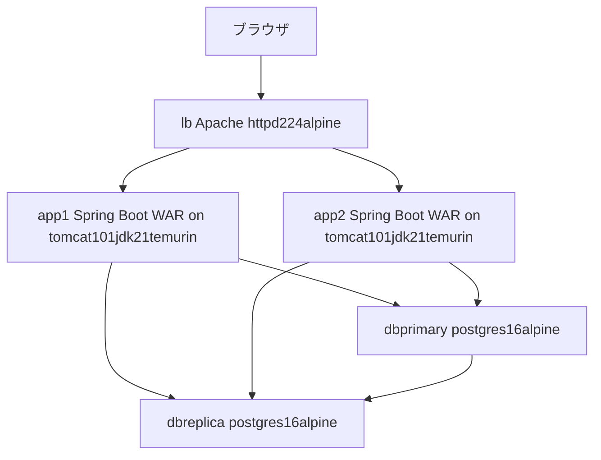

# コンテナ化設計: simple-shopping-site

## アプリケーション概要

| 項目 | 値 |
|------|-----|
| 言語 | Java 21 |
| フレームワーク | Spring Boot 3.3.5（WAR パッケージング、standalone Tomcat 前提） |
| ランタイム | 標準 Tomcat 10.1+（`spring-boot-starter-tomcat` は `provided` スコープのため WAR に同梱されない） |
| エントリポイント | `com.example.shop.ShoppingApplication`（WAR を Tomcat 10.1 の `webapps/` にデプロイして起動。コンテキストパス `/shop`） |
| ポート | 8080（HTTP、コンテキストパス `/shop`） |
| パッケージマネージャー | Maven（`mvn clean package` → `target/simple-shopping-site-1.0.0-SNAPSHOT.war`） |

## 外部依存サービス

| 依存 | 用途 | バージョン |
|------|------|-----------|
| PostgreSQL（Primary） | 書き込み用データベース（Flyway マイグレーション実行先） | 16 |
| PostgreSQL（Replica） | 読み取り専用データベース（`@Transactional(readOnly = true)` を `ha` プロファイルで自動ルーティング、`DataSourceConfig.java`） | 16（ストリーミングレプリケーション） |
| Apache HTTP Server（mod_proxy_balancer） | アプリ 2 インスタンスへのロードバランサー（`apache/httpd-lb.conf`） | 2.4 |
| Flyway | DB スキーマ管理（アプリ起動時に自動適用、`src/main/resources/db/migration/`） | Spring Boot 管理バージョン |

外部 API 呼び出しはなし。ステートレス JWT 認証のためセッションストア（Redis 等）は不要。

## 環境変数

### 共通（`application.yml`）

| 変数名 | 必須/任意 | デフォルト | 説明 |
|--------|-----------|-----------|------|
| `DB_HOST` | 任意 | `localhost` | 非 HA プロファイル時の DB ホスト |
| `DB_PORT` | 任意 | `5432` | 非 HA プロファイル時の DB ポート |
| `DB_USER` | 任意 | `shopuser` | DB ユーザー |
| `DB_PASSWORD` | **必須** | なし | DB パスワード |
| `JWT_SECRET` | **必須** | なし | JWT 署名鍵（HMAC-SHA256 使用のため **256 bit（32 バイト）以上**必須。`JwtTokenProvider` が `Keys.hmacShaKeyFor` で鍵長を検証し、不足時は起動時例外） |

### HA プロファイル追加（`application-ha.yml`）

| 変数名 | 必須/任意 | デフォルト | 説明 |
|--------|-----------|-----------|------|
| `DB_PRIMARY_HOST` / `DB_PRIMARY_PORT` | 任意 | `127.0.0.1` / `5432` | 書き込み先 Primary DB |
| `DB_REPLICA_HOST` / `DB_REPLICA_PORT` | 任意 | `127.0.0.1` / `5433` | 読み取り先 Replica DB |
| `JWT_SECRET` | 任意（開発用デフォルトあり） | 32 バイト超のサンプル文字列 | 本番では必ず明示的に上書きすること |

## Before: 現在のアーキテクチャ

VM ないしベアメタル上に Tomcat 10.1 を手動セットアップし、WAR ファイルを `webapps/` へ配置してデプロイする構成。Apache HTTP Server がラウンドロビンで 2 台の Tomcat インスタンスへ振り分け、アプリは `ha` プロファイルで PostgreSQL の Primary（書き込み）/ Replica（読み取り）へ接続先を自動切替する。DB のストリーミングレプリケーションは `db/replica-setup.md` の手順で手動構築されている。

## After: コンテナ化後のアーキテクチャ

Docker Compose 上に `lb`（Apache LB）、`app1`/`app2`（同一イメージの Spring Boot WAR コンテナ、`ha` プロファイルで起動しポート 8080 で待受）、`db-primary`/`db-replica`（PostgreSQL 16、ストリーミングレプリケーション）を配置する。LB の `BalancerMember` は Docker ネットワーク内のサービス名 `app1`/`app2` を参照し、`127.0.0.1` を使わない。各サービスは named network で接続し、DB データは named volume に永続化する。

## コンテナイメージ一覧

| サービス名 | 種別 | イメージ / ベースイメージ | 説明 |
|-----------|------|--------------------------|------|
| app1 / app2 | 新規ビルド | `tomcat:10.1-jdk21-temurin` ベース | Maven マルチステージビルドで WAR を生成し、Tomcat の `webapps/` にデプロイ。同一イメージを 2 インスタンス起動（`server.port`固定・`spring.profiles.active=ha`） |
| lb | 新規ビルド（既存 `apache/Dockerfile` を利用） | `httpd:2.4-alpine` ベース | `apache/httpd-lb-docker.conf` を組み込み済みの mod_proxy_balancer LB |
| db-primary | 外部イメージ | `postgres:16-alpine` | Flyway 管理のプライマリ DB。WAL 設定・レプリケーションユーザーは init スクリプトで作成 |
| db-replica | 外部イメージ | `postgres:16-alpine` | `pg_basebackup` でプライマリから複製したストリーミングレプリカ（読み取り専用） |

## コンテナ化ノート

- **ビルド戦略**: アプリは Maven ビルドが必要なためマルチステージビルドを採用する（`maven:3.9-eclipse-temurin-21` 等でビルド → 実行ステージは `tomcat:10.1-jdk21-temurin` に WAR のみコピー）。JDK 17+ 環境のため alpine 版 Tomcat タグは存在せず、Ubuntu ベースの `-temurin` タグを使用する。
- **ベースイメージ選定**: LB（`httpd:2.4-alpine`）は既に `apache/Dockerfile` で最小構成が用意済みのためそのまま採用。DB は公式 `postgres:16-alpine` をバージョンピンして使用する。
- **app1/app2 の同一性**: 両インスタンスは同一 Dockerfile/イメージから起動し、`server.port` と `spring.profiles.active=ha` のみ compose 側で差異化する（イミュータブルインフラの原則、12factor の「Build, Release, Run」分離に準拠）。
- **シークレット**: `DB_PASSWORD` と `JWT_SECRET` は環境変数経由で注入する。`JWT_SECRET` は HMAC-SHA256 前提のため 32 バイト以上のデフォルトプレースホルダーを compose に設定すること（空文字・未設定は起動時エラー）。
- **DB レプリケーション**: primary はバックグラウンドプロセスを使わない通常の `postgres` コマンド起動とし、レプリケーションユーザー作成・`pg_hba.conf` 設定は `docker-entrypoint-initdb.d` 配下の `.sql` ファイルで行う（`.sh` は macOS virtioFS 環境で実行権限問題が起きるため使用しない）。replica は `pg_basebackup` 実行後に `chmod 0700` を行い、最終的に `exec gosu postgres postgres` で起動する。
- **ヘルスチェック**: アプリは Spring Boot Actuator の `/shop/actuator/health` を HTTP ヘルスチェックに使用する。LB は `httpd -t` による設定検証、DB は `pg_isready` / `pg_stat_replication`（replica は `pg_stat_wal_receiver`）で判定する。DB は起動が遅いため `start_period` は 60 秒以上を設定する。
- **永続化**: `db-primary`・`db-replica` のデータディレクトリは named volume に保存し、コンテナ削除後もデータを保持する。
- **潜在的な問題点**:
  - `application-ha.yml` の `JWT_SECRET` にはデフォルト値があるため、本番相当の compose では明示的に上書きしないと開発用の弱い鍵が使われてしまう。
  - LB の `httpd-lb-docker.conf` は既に Docker サービス名（`app1`/`app2`）を参照しており `127.0.0.1` 問題は解消済みだが、非 Docker 用の `httpd-lb.conf`（`127.0.0.1` 参照）と混同しないよう注意する。
  - Replica 起動時は Primary が `pg_stat_replication` に反映されるまでのタイムラグがあるため、テストスクリプトのポーリング設計に考慮が必要。
